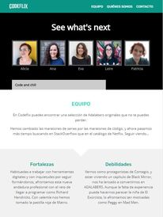
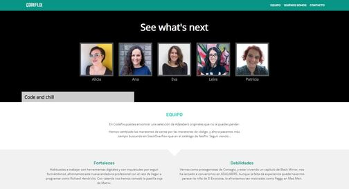

# Codeflix

Module 1 team project of the Adalab Digital Frontend Development Bootcamp.

This is a responsive website developed with `HTML5` , `CSS3` and `SASS`.

## **Authors**

This website has been developed by Codeflix Team:

- Alicia Colom: @alicia-colom
- Eva Ferreras: @evaferrerasbr
- Ana Guerra: @anaguerraabaroa
- Leire Ordeñana: @leireomadina
- Patricia Poveda: @PatriciaPoveda

## **Quick start guide**

Instructions to start this project:

### **Pre-requirements**

This project is run with Adalab Starter Kit [here](https://github.com/Adalab/adalab-web-starter-kit).

In order to use this kit it is needed to previously install [`node.js`](https://nodejs.org/es/), [`git`](https://git-scm.com/) and [`gulp.js`](https://gulpjs.com/) to automate tasks and control project versions.

### **Installation**

1. Clone repository
2. Open a terminal
3. Run `npm install` on the terminal to install local dependencies

### **Run project**

Run `npm start` on the terminal.

This command has to be run everytime the project is started in order to:

1. Open the project on the browser using a local server.
2. Refresh browser everytime files contained in `/src` folder are updated.
3. Compiled files contained in `/src` folder and copy them in `/public` folder in order to be prepared for production environment.

### **Deployment**

1. Run these commands to update changes on the project:

```
git add -A
git commit -m "Message commit"
git push
```

2. Run `npm run docs` to create `/docs` folder and the production environment version.

3. Run again commands on step 1 to update changes on the project.

4. Project **[URL](https://anaguerraabaroa.github.io/Codeflix/)** is also available on GitHub Pages.

## **Development technologies**

- [**`HTML5`**](https://html.spec.whatwg.org/)
- [**`CSS3`**](https://www.w3.org/Style/CSS/)
- [**`SASS`**](https://sass-lang.com/)

## **Project development requirements**

- Responsive web design for mobile, tablet and desktop devices
- Fixed header with the team logo and a navigation menu
- Hero with the team image and claim
- Strengths and weaknesses section with the team description
- Team members section with an image, description and social media links
- Contact form integrated with free data service [**`formspree`**](https://formspree.io/)
- Footer with logo and navigation menu

## **Folder Structure**

```
Codeflix
├── docs
├── node_modules
├── public
├── src
│   ├── html
│   │   ├── partials
│   │   │   ├── about.html
│   │   │   ├── adalabers.html
│   │   │   ├── card.html
│   │   │   ├── footer.html
│   │   │   ├── form.html
│   │   │   ├── header.html
│   │   │   ├── hero-contact.html
│   │   │   ├── hero.html
│   │   │   └── strengths-weaknesses.html
│   │   ├── contact.html
│   │   └── index.html
│   ├── images
│   │    ├── adalab_brand.png
│   │    ├── alicia-colom_monica-geller.jpg
│   │    ├── alicia-colom.jpg
│   │    ├── ana-guerra_jess-day.jpg
│   │    ├── ana-guerra.jpg
│   │    ├── dana-scully_phone.jpg
│   │    ├── eva-ferreras_louise-banks.jpg
│   │    ├── eva-ferreras.jpg
│   │    ├── jess-day_phone.jpg
│   │    ├── leire-ordenana_dana-scully.jpg
│   │    ├── leire-ordenana.jpg
│   │    ├── louise-banks_phone.jpg
│   │    ├── monica-geller_phone.jpg
│   │    ├── patricia-poveda_sarah-connor.jpg
│   │    ├── patricia-poveda.jpg
│   │    └── sarah-connor_phone.jpg
│   └── scss
│       ├── components
│       │   ├── _card.scss
│       │   └── _form.scss
│       ├── core
│       │   ├── _normalize.scss
│       │   ├── _reset.scss
│       │   └── _variables.scss
│       ├── layout
│       │   ├── _about.scss
│       │   ├── _adalabers.scss
│       │   ├── _footer.scss
│       │   ├── _header.scss
│       │   ├── _hero.scss
│       │   └── _strengths.scss
│       └── main.scss
├── .browserslistrc
├── .csscomb.json
├── .eslintrc.json
├── .gitignore
├── config.json
├── gulp-flow.png
├── gulpfile.js
├── LICENSE
├── package-lock.json
├── package.json
├── README.md
└── robots.txt
```

## **Result**

  
