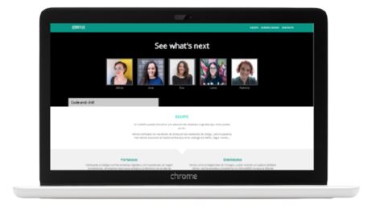
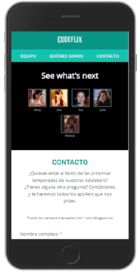

  

  

# **Codeflix**

## **About**

Module 1 team project of the Adalab Digital Frontend Development Bootcamp.

This is a responsive website developed with [](https://html.spec.whatwg.org/) [](https://www.w3.org/Style/CSS/) and [](https://sass-lang.com/)

**[Project URL](https://anaguerraabaroa.github.io/codeflix/)** is available on GitHub Pages.

## **Codeflix Team**

This project has been developed by Codeflix Team:

- **Alicia Colom:** [@alicia-colom](https://github.com/alicia-colom)
- **Eva Ferreras:** [@evaferrerasbr](https://github.com/evaferrerasbr)
- **Ana Guerra:** [@anaguerraabaroa](https://github.com/anaguerraabaroa)
- **Leire Ordeñana:** [@leireomadina](https://github.com/leireomadina)
- **Patricia Poveda:** [@PatriciaPoveda](https://github.com/PatriciaPoveda)

## **Quick start guide**

Instructions to start this project:

## Installation

- Clone repository:

```
git clone [repository]
```

- Install NPM packages and dependencies:

```
npm install
```

- Run project on local server:

```
npm start
```

## **Features**

- Responsive web design for mobile, tablet and desktop devices
- Fixed header with the team logo and a navigation menu
- Hero with the team image and claim
- Strengths and weaknesses section with the team description
- Team members section with an image, description and social media links
- Contact form integrated with free data service [**`formspree`**](https://formspree.io/)
- Footer with logo and navigation menu

## **Folder Structure**

```
Codeflix
├── docs
├── node_modules
├── public
├── src
│   ├── html
│   │   ├── partials
│   │   │   ├── about.html
│   │   │   ├── adalabers.html
│   │   │   ├── card.html
│   │   │   ├── footer.html
│   │   │   ├── form.html
│   │   │   ├── header.html
│   │   │   ├── hero-contact.html
│   │   │   ├── hero.html
│   │   │   └── strengths-weaknesses.html
│   │   ├── contact.html
│   │   └── index.html
│   ├── images
│   │    ├── adalab_brand.png
│   │    ├── alicia-colom_monica-geller.jpg
│   │    ├── alicia-colom.jpg
│   │    ├── ana-guerra_jess-day.jpg
│   │    ├── ana-guerra.jpg
│   │    ├── contact_desktop.png
│   │    ├── contact_mobile.png
│   │    ├── contact_tablet.png
│   │    ├── dana-scully_phone.jpg
│   │    ├── eva-ferreras_louise-banks.jpg
│   │    ├── eva-ferreras.jpg
│   │    ├── jess-day_phone.jpg
│   │    ├── landing_desktop.png
│   │    ├── landing_mobile.png
│   │    ├── landing_tablet.png
│   │    ├── leire-ordenana_dana-scully.jpg
│   │    ├── leire-ordenana.jpg
│   │    ├── louise-banks_phone.jpg
│   │    ├── monica-geller_phone.jpg
│   │    ├── patricia-poveda_sarah-connor.jpg
│   │    ├── patricia-poveda.jpg
│   │    └── sarah-connor_phone.jpg
│   └── scss
│       ├── components
│       │   ├── _card.scss
│       │   └── _form.scss
│       ├── core
│       │   ├── _normalize.scss
│       │   ├── _reset.scss
│       │   └── _variables.scss
│       ├── layout
│       │   ├── _about.scss
│       │   ├── _adalabers.scss
│       │   ├── _footer.scss
│       │   ├── _header.scss
│       │   ├── _hero.scss
│       │   └── _strengths.scss
│       └── main.scss
├── .browserslistrc
├── .csscomb.json
├── .eslintrc.json
├── .gitignore
├── config.json
├── gulp-flow.png
├── gulpfile.js
├── LICENSE
├── package-lock.json
├── package.json
├── README.md
└── robots.txt
```

## **License**

This project is licensed under 
